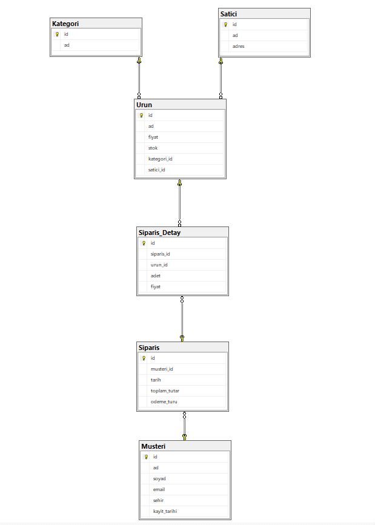

# Bitirme Projesi: Online Alışveriş Platformu Veri Tabanı

## Proje Amacı
Bu proje, Trendyol / Hepsiburada / Amazon benzeri bir e-ticaret sisteminin veritabanını modellemek için tasarlanmıştır.  
Amaç; müşteri, ürün, sipariş, kategori ve satıcı ilişkilerini doğru şekilde kurarak veri ekleme, güncelleme ve raporlama işlemlerini SQL üzerinden gerçekleştirmektir.

---

## Veri Tabanı Tasarımı

**Oluşturulan Tablolar:**
- **Musteri** (id, ad, soyad, email, sehir, kayit_tarihi)  
- **Kategori** (id, ad)  
- **Satici** (id, ad, adres)  
- **Urun** (id, ad, fiyat, stok, kategori_id, satici_id)  
- **Siparis** (id, musteri_id, tarih, toplam_tutar, odeme_turu)  
- **Siparis_Detay** (id, siparis_id, urun_id, adet, fiyat)

**İlişkiler:**
- Bir müşteri birden fazla sipariş verebilir.  
- Bir sipariş birden fazla ürün içerebilir.  
- Her ürün bir kategoriye ve bir satıcıya aittir.  
- Sipariş-ürün ilişkisi **Siparis_Detay** tablosu üzerinden yönetilir.

---

## Veri Ekleme ve Güncelleme
Veritabanına örnek **kategori, satıcı, müşteri ve ürün verileri** eklenmiştir.  
`INSERT`, `UPDATE`, `DELETE` ve `TRUNCATE` komutları aktif olarak kullanılmıştır.  

Ek olarak:
- **Trigger** ile stok kontrolü yapılmıştır.  
  Eğer stok yetersizse sipariş işlemi iptal edilir ve hata mesajı gösterilir.

---

## 📊 ER Diyagramı Görseli

---

## Veri Sorgulama ve Raporlama

**Temel Sorgular:**
- En çok sipariş veren 5 müşteri  
- En çok satılan ürünler  
- En yüksek cirolu satıcılar  

**Aggregate & Group By:**
- Şehirlere göre müşteri sayısı  
- Kategori bazlı toplam satış  
- Aylara göre sipariş sayısı  

**Join Sorguları:**
- Siparişlerde müşteri + ürün + satıcı bilgileri  
- Hiç satılmamış ürünler  
- Hiç sipariş vermemiş müşteriler  

**İleri Seviye (Opsiyonel):**
- En çok kazanç sağlayan ilk 3 kategori  
- Ortalama sipariş tutarını geçen siparişler  
- En az bir kez elektronik ürün alan müşteriler  

---

## Karşılaşılan Sorunlar ve Çözümler
- **Trigger Hatası:** Başta stok azaltma işleminde “inserted” tablosuna erişilemedi.  
  → `AFTER INSERT` kullanılarak düzeltildi.  

- **Veri Tutarlılığı:** Rastgele eklenen veriler stokta dengesizlik yarattı.  
  → `UPDATE` sorguları ile stok güncellendi.  

- **Sipariş scripti:** Stoktaki ürünler ile müşterinin satın aldığı ürün arasındaki bağlantı zorluk çıkardı.  
  → Stok sayısı ve müşterinin kategorilerden ve ürünlerden yaptığı alışveriş dikkatlice dengelendi.

---

## Sonuç
Veri tabanı tasarımı, veri bütünlüğü ve sorgular, tüm teslim kriterlerini karşılamaktadır.  
Projede:
- 6 ilişkisel tablo  
- 1 trigger  
- 10+ farklı raporlama sorgusu  
- 3 ileri seviye analiz sorgusu  
başarıyla uygulanmıştır.  

Sistem, SQL üzerinde tam fonksiyonel çalışmakta ve tüm CRUD işlemlerini desteklemektedir.

---

## Proje Dosyaları
- `bitirme_projesi.sql` → Tüm tablo, veri ve sorgular  
- `Bitirmeprojesi_Diagram.png` → Veritabanı diyagramı  
- `Dokümantasyon.md` → Proje açıklama dosyası  

---

## Geliştirici
**Ad Soyad:** Baha Lor

**Proje:** Bitirme Projesi – SQL E-Ticaret Veritabanı  

